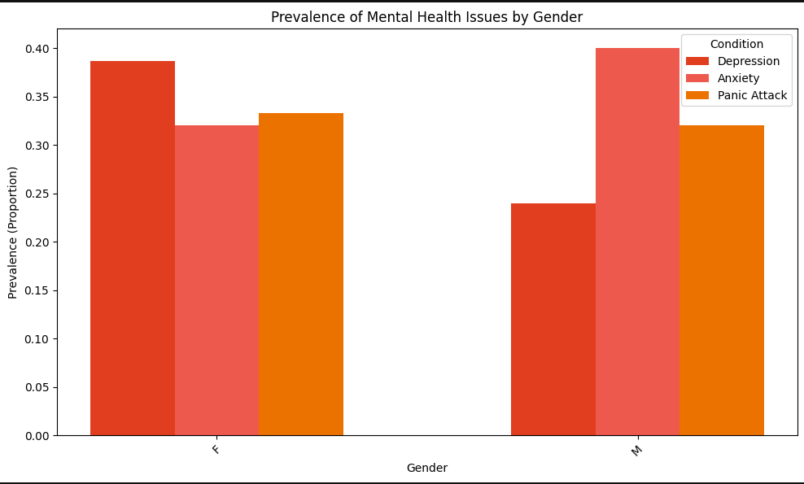
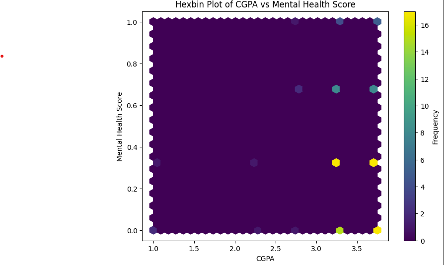

# Mental Health and Academic Performance Analysis

This project explores the relationship between students' mental health conditions and their academic performance using data analysis and visualization techniques in Python.

## Project Overview

Mental health can strongly affect a student’s learning experience, productivity, and academic outcomes. In this project, I analyzed a student dataset to identify patterns, trends, and possible relationships between mental health-related factors and academic performance.

The goal of this project is to better understand how factors such as stress, anxiety, depression, or lifestyle habits may influence students' academic results.

## Objectives

- Explore the dataset and understand the key features
- Clean and preprocess the data for analysis
- Perform exploratory data analysis (EDA)
- Visualize relationships between mental health indicators and academic performance
- Identify key findings and trends from the dataset

## Tools and Technologies

- Python
- Pandas
- NumPy
- Matplotlib
- Seaborn
- Jupyter Notebook

 
## Workflow 

### 1. Data Loading
Imported the dataset into Python for analysis
### 2. Data Cleaning
Checked for missing values
Examined data types
Prepared the dataset for analysis
### 3. Exploratory Data Analysis
Investigated distributions of important variables
Analyzed possible relationships between mental health and academic performance
Observed patterns through statistical summaries and visualizations
### 4. Visualization
Created charts and plots to better understand the data
Highlighted trends and comparisons across different student factors
### 5.Key Insights
Mental health-related factors may have a noticeable impact on student academic performance
Patterns in the data suggest that emotional and psychological well-being should be considered alongside academic support
Data visualization helps reveal trends that may not be obvious from raw data alone


## Visualizations

### Gender Distribution


### Mental Health by Gender


### CGPA vs Mental Health Score


## Why This Project Matters

Student mental health is an important topic in education. This project shows how data analysis can be used to better understand student challenges and support evidence-based decision-making in academic environments.

## Project Structure

```bash
mental-health-academic-analysis/
│
├── Analysis_of_Student_Mental_Health_and_Academic_Performance.ipynb
└── README.md
